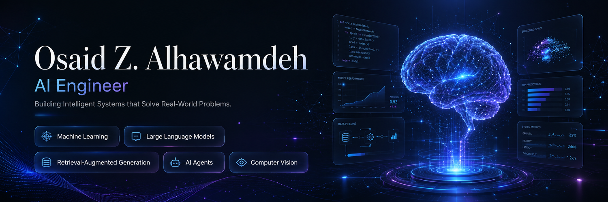
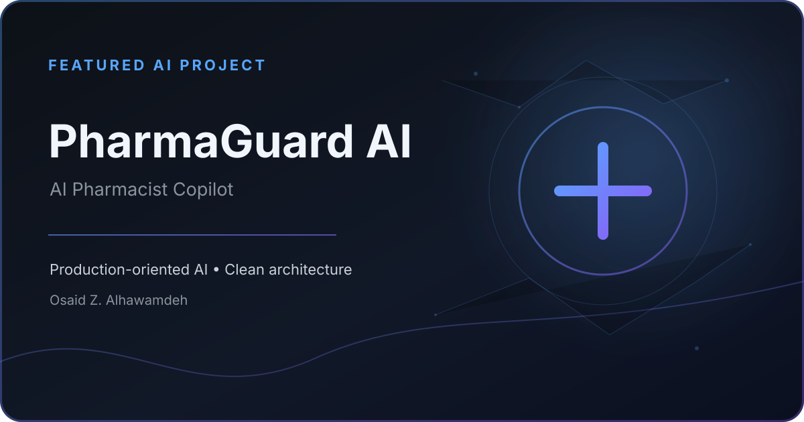
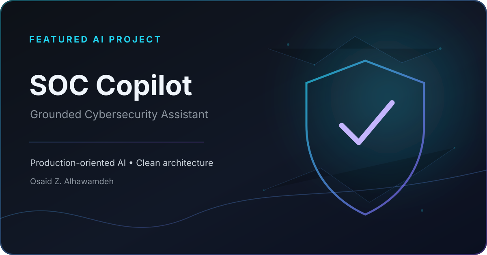
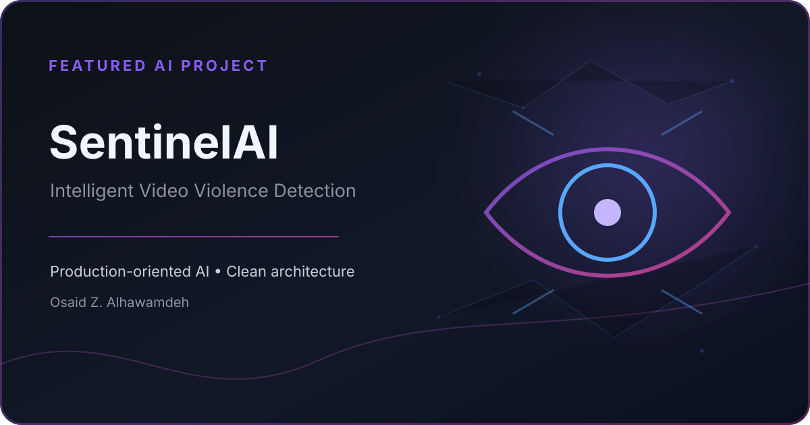
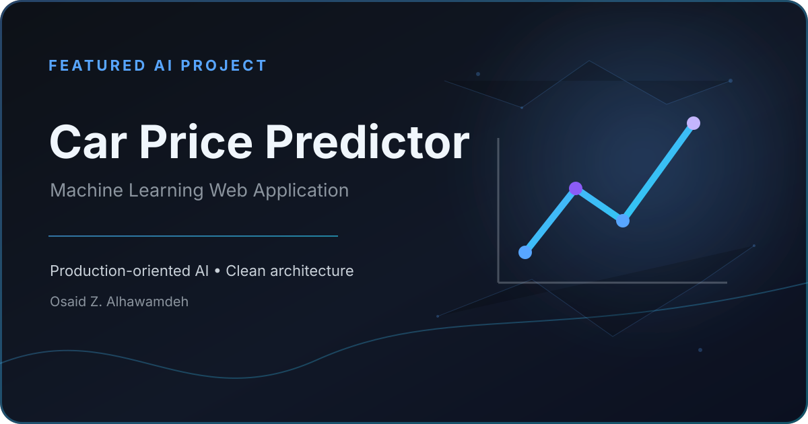

<!--
  Osaid Z. Alhawamdeh — GitHub Profile README V3
  Repository name must match your username exactly: OsaidZiad04
-->

  

# Osaid Z. Alhawamdeh

### AI Engineer · Machine Learning Engineer · AI Trainer

Building production-oriented intelligent systems that turn real-world challenges into practical AI solutions.

 

  

 

 

## Selected Work

<table>
<tr>
<td width="50%" valign="top">

### PharmaGuard AI

AI-powered pharmacist copilot for reviewing prescriptions using OCR, grounded retrieval, and drug knowledge bases.

`Python` `FastAPI` `RAG` `OCR` `LLMs`

</td>
<td width="50%" valign="top">

### SOC Copilot

Grounded AI assistant for security operations, structured investigation workflows, and reliable JSON outputs.

`Python` `FastAPI` `RAG` `Cybersecurity` `LLMs`

</td>
</tr>

<tr>
<td width="50%" valign="top">

### SentinelAI

Deep learning violence-detection system for surveillance video using EfficientNetB0 and Bi-LSTM architectures.

`TensorFlow` `OpenCV` `EfficientNetB0` `Bi-LSTM`

</td>
<td width="50%" valign="top">

### Car Price Predictor

End-to-end machine learning web application for estimating vehicle prices with XGBoost and Streamlit.

`Python` `XGBoost` `Streamlit` `Machine Learning`

</td>
</tr>
</table>

 

## Engineering Profile

 

<table>
<tr>
<td width="50%" valign="top">

### What I Engineer

I design and build **production-oriented AI systems** that combine reliable data pipelines, modern machine learning, and practical user experiences.

- Grounded LLM applications
- Retrieval-Augmented Generation pipelines
- AI agents and workflow automation
- Computer vision and deep learning systems
- FastAPI-based AI services and web applications

</td>
<td width="50%" valign="top">

### Current Direction

My current work is focused on turning advanced AI capabilities into systems that are **reliable, useful, and deployable**.

- AI-powered healthcare applications
- Evaluated and trustworthy RAG systems
- Agentic AI architectures
- Production AI engineering
- Responsible AI education and adoption

</td>
</tr>
</table>

 

## Technology Stack

  

 

## GitHub Analytics

  

 

## Impact & Recognition

<table>
<tr>
<td width="25%" align="center" valign="top">

### 🥉

**3rd Place**

IEEE Jordan AI Modeling Hackathon

</td>
<td width="25%" align="center" valign="top">

### 🥈

**2nd Place**

Irada Tech Entrepreneurship Hackathon

</td>
<td width="25%" align="center" valign="top">

### 🌍

**Jordan Representative**

International AI Forum · Egypt

</td>
<td width="25%" align="center" valign="top">

### 👨‍🏫

**14+ Workshops**

AI & Digital Skills Training

</td>
</tr>
</table>

 

## Let's Build Something Intelligent

I am interested in AI engineering, applied research, product collaboration, training, and community-focused technology initiatives.

 

  

Designed as a focused AI engineering portfolio inside GitHub.

